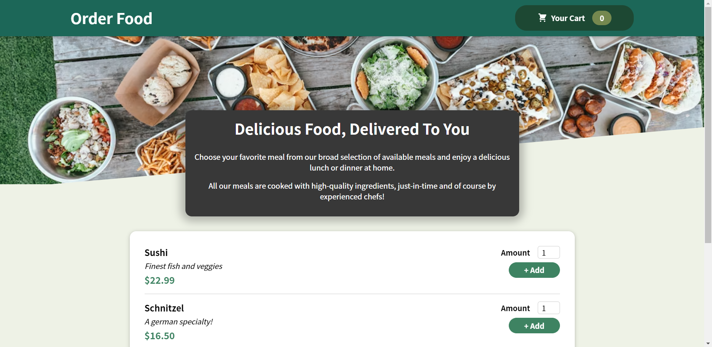
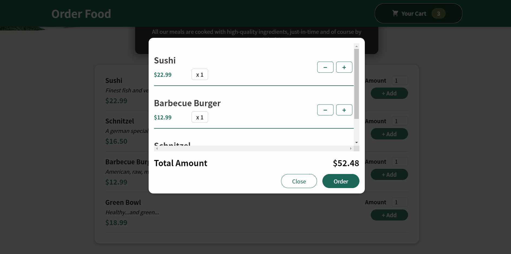
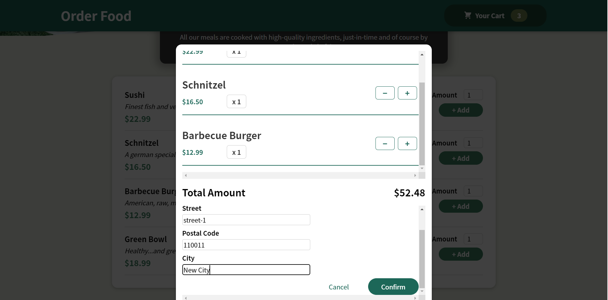
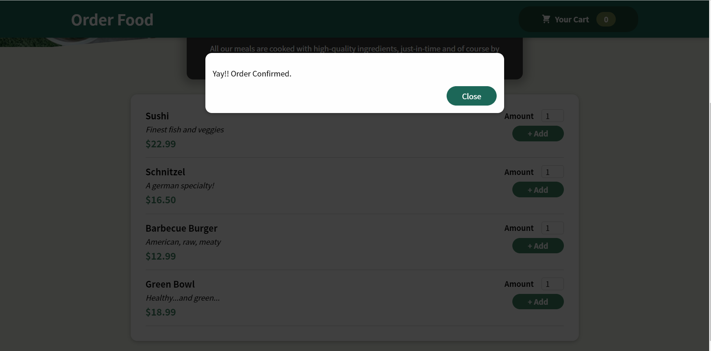

# React Food Ordering Website
This is a food ordering website built with React and context API. It has a menu of dishes to order items that get added to user's cart. The cart is fully functional with options of incrementing/ decrementing individual items and also removing them.
On confirming, the user is shown a form to enter their details and place their order. Successful order submission is shown by a confirmation Modal.
It uses Firebase to store order and user details.

<br>

# 💻Tech Stack Used
- Frontend - React
- Database - Firebase

<br>

# ✨ Requirements
- Any Operating System (ie. MacOS X, Linux, Windows) with MySQL installed for the respective OS
- Any IDE with Flutter SDK installed (ie. VSCode etc)

<br>

# 📝Steps to run
<br>

1. Clone this repository. You will need `node` and `npm` installed globally on your machine.
```
git clone https://github.com/your_username/WebArena
```
2. Run this command to install all the packages:
```
npm i
```
3. To start app:
```
npm start
```

# Screenshots

### ⚡ Landing Page
<br>
<p align="center">
    </img> 
</p>
<br>

### ⚡ Cart Preview
<br>
<p align="center">
    </img>
</p>
<br>

### ⚡ User Details Form
<br>
<p align="center">
    </img> 
</p>
<br>

### ⚡ Order Confirmation Modal
<br>
<p align="center">
    </img> 
</p>
<br>